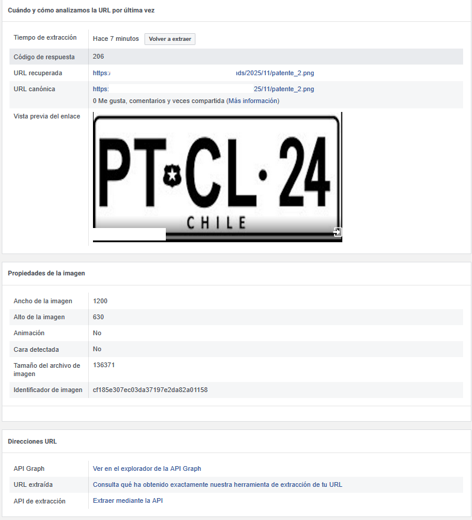

# Imagenes-en-Whatsapp-por-link
Se explica como se puede enviar una imagen por whatsapp como link y que se renderice

## Caracteristicas de la imagen

1. Debe ser minimo 200 x 200 pixeles
2. Se recomienda 1200 x 630
3. Se recomienda .png o .jpg
4. Debe estar alojada en un servidor
5. Debe estar publica
6. No puede ser una imagen compartida por google drive
7. IMPORTANTE: la imagen se puede enviar solo desde la pestaña "BOT RESPONDE" en formato [image](url)

> [!WARNING] 
> El motivo es técnico, pero sencillo de entender:
> Google Drive no da un enlace directo a la imagen: Cuando compartes un enlace de Google Drive, en realidad estás compartiendo un enlace a una página web de Google que muestra tu imagen. 
> El robot de Facebook no puede "ver" la imagen: El robot (crawler) de Facebook, LinkedIn, etc., necesita un enlace directo que termine en .png o .jpg (como el que tienes ahora). No es lo suficientemente "inteligente" para navegar por la página de vista previa de Google Drive y encontrar la imagen dentro.


## Donde se puede validar que esta bien la imagen

1. Se puede usar el link de facebook para validar que la imagen este lista para ser compartida
    [Validar en Facebook](https://developers.facebook.com/tools/debug)

2. Para linkedin
    [Validar en Linkedin](https://www.linkedin.com/post-inspector/)

3. Para Twitter o X
    [Validar X](https://cards-dev.x.com/validator)

Ejemplo de una imagen aprobada y lista para compartir:



## Html recomendado con las configuraciones necesarias para OpenGraph

Configuraciones de OG:

```html
<!DOCTYPE html>
<html lang="es">
<head>
    <meta charset="UTF-8">
    <meta name="viewport" content="width=device-width, initial-scale=1.0">
    
    <title>[Tu Título Aquí]</title>

    <meta property="og:title" content="[Tu Título Aquí]">
    <meta property="og:description" content="[Escribe tu descripción corta aquí]">
    <meta property="og:type" content="website">
    
    <meta property="og:url" content="[La URL completa de esta página]"> 
    
    <meta property="og:image" content="[La URL completa de tu imagen .jpg o .png]">
    <meta property="og:image:width" content="1200">
    <meta property="og:image:height" content="630">

    <meta name="twitter:card" content="summary_large_image">
    <meta name="twitter:title" content="[Tu Título Aquí]">
    <meta name="twitter:description" content="[Escribe tu descripción corta aquí]">
    <meta name="twitter:image" content="[La URL completa de tu imagen .jpg o .png]">
    </head>
<body>

    <h1>[Encabezado de tu Página]</h1>
    <p>[Contenido de tu página aquí].</p>

</body>
</html>
```
